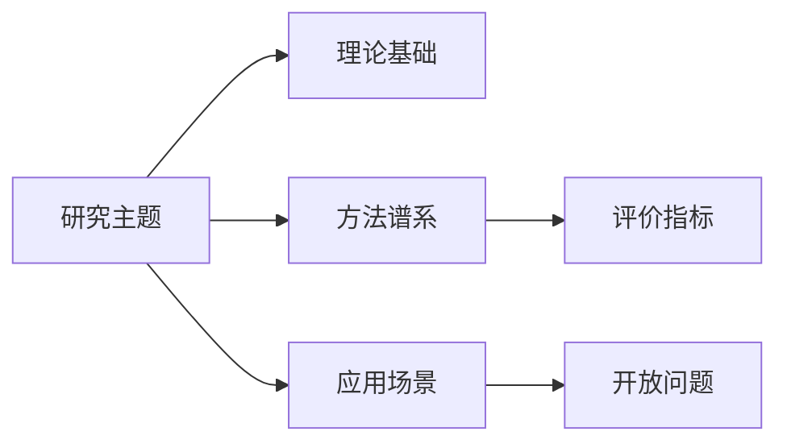

# 写作与引用体例参考

## 学术表达

- 使用客观、审慎、可核验的表达。
- 避免“首次、唯一、完全解决、显著优于所有方法”等无法证明的绝对化表述。
- 全文使用自然、正式的学术英语。首次出现的缩写应先给出完整英文名称；不得混入中文解释、中文标题或双语图表标签。
- 避免 AI 模板化表达：不要频繁使用“本文系统性地”“核心挑战包括”“该图用于回答 RQx”等机械句式。
- 减少大段项目符号和过度粗体；正式综述应以连续论述段落为主。
- RQ 可以作为结构线索，但正文不应写成问答填空。需要通过时间演化、主题分化、方法转向、证据争议等主线自然展开。
- 图表说明应自然嵌入论述，并如实说明数据来源类型：本次筛选统计、二级综述汇总、估算值或人工编码。

## 引用

按用户要求采用 APA、GB/T 7714、IEEE、MLA、Chicago 或目标期刊格式。未指定时：

- 中文学位/课程论文倾向 GB/T 7714。
- 英文论文倾向 APA 或目标期刊格式。

引用信息不完整时保留占位并标注待核验，例如：

`（Author, Year，题名待核验）`

## 表格建议

常用表格：

- 文献检索记录表
- 代表性研究对比表
- 方法分类表
- 数据集与评价指标表
- 研究空白与未来方向表

## Mermaid 示例

